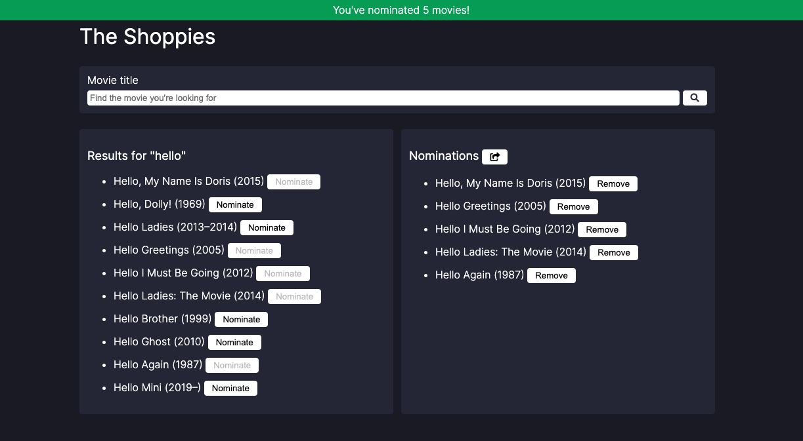

# Shopify Frontend Challenge
## The Shoppies
Movie awards for entrepreneurs

   

## Summary
I built this app as part of my application to the Front-End Developer Internship at Shopify. You can view the live site [here](https://carolinesekel.github.io/shopify-frontend-challenge-summer-2021/).

## The Challenge
"We need a webpage that can search [OMDB](http://www.omdbapi.com/) for movies, and allow the user to save their favourite films they feel should be up for nomination. When they've selected 5 nominees they should be notified they're finished."
### Technical Requirements
* Search results should come from OMDB's API
* Each search result should list at least its title, year of release and a button to nominate that film
* Updates to the search terms should update the result list
* Movies in search results can be added and removed from the nomination list
* If a search result has already been nominated, disable its nominate button
* Display a banner when the user has 5 nominations
### Extras
I implemented the following "extras"
* Different design/styling (I went with a dark mode app)
* Ability to share your nominations via email 

## Built with
* HTML
* CSS
* Vanilla JS

## Thoughts/Issues/Things to improve
### ES6 
I used JS features from ES6 which may not work depending on the browser. A transpiler like [Babel](https://babeljs.io/) can be used to solve this.
### Separation of Concerns
I belive my code can definitely be cleaned up and made more modular, there are places where I began to think separate functions could be made, etc. but I am leaving it as is because it is evidence of the way I was thinking while solving the problem. 
### 5+ nominations
I did not implement restrictions for the user past 5 nominations, so although a banner appears when the user reaches 5 nominations, the buttons to nominate are not disabled. This can/should be fixed in the future.
### Save nomination list on page reload and leaving page
Use localStorage to save nominations list - function to load nominations from localStorage, and update using localStorage.setItem when adding or removing nominations, can also implement a clear button to remove all nominations at once and clear local storage
